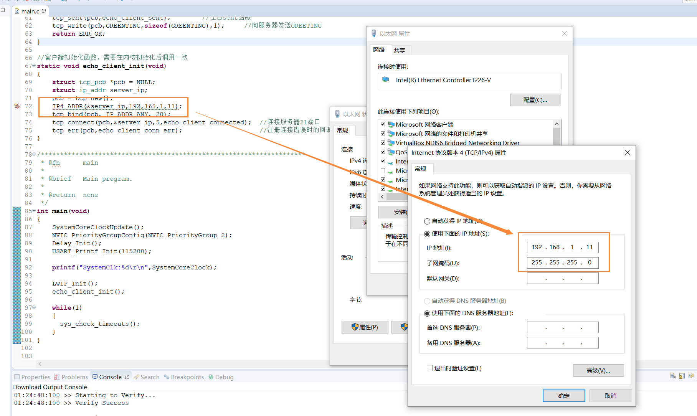
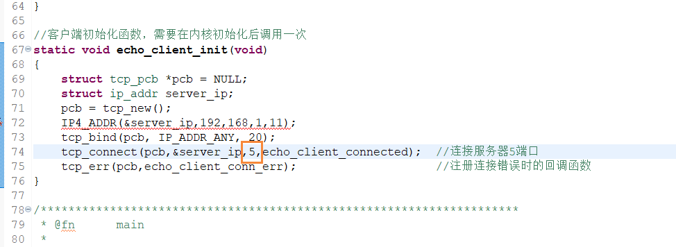
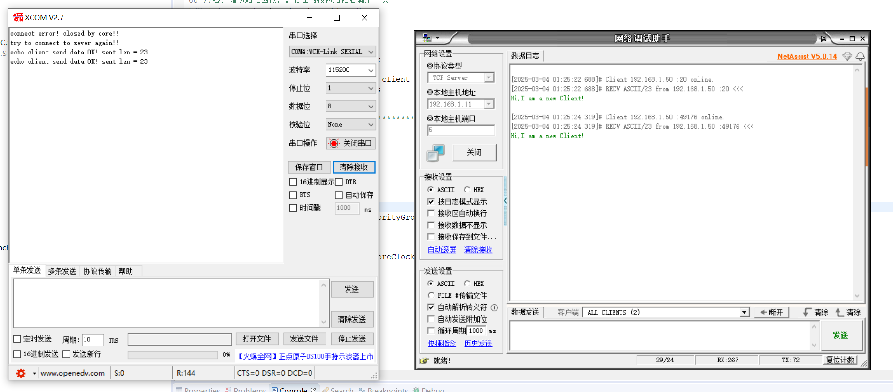

# CH32V307_lwIP-1.41_Baremetal

将lwIP1.41移植到ch32V307上（NETCONN API）  

使用芯片内部的10MPHY层实现TCPIP协议栈    

##### Memory 配置

烧录时，需选择相应的 Memory 配置，并点击 Apply。

##### 配置 IP 地址

##### TCP 测试

例程是做TCP客户端。

##### 注意

Baremetal 和 FreeRTOS 中 .s，.ld 里的文件有区别的！对不上的话可能会无法正常通讯...