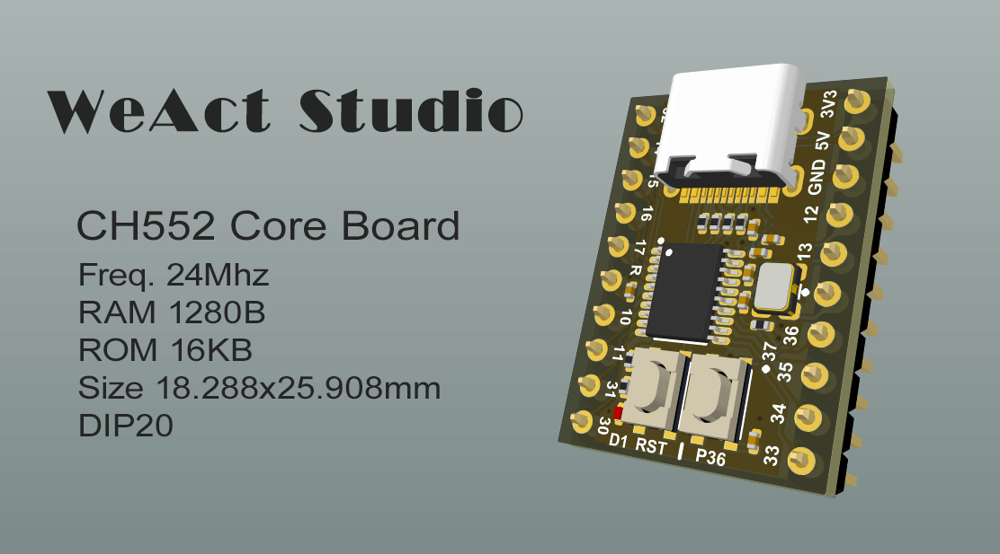

# CH552

CH552 芯片是一款兼容 MCS51 指令集的增强型 E8051内核单片机，其 79%的指令是单字节单周期指令，平均指令速度比标准 MCS51 快 8～15 倍。  

CH552 支持最高 24MHz 系统主频，内置 16K 程序存储器 ROM 和 256 字节内部 iRAM 以及 1K 字节片内 xRAM，xRAM 支持 DMA 直接内存存取。  

CH552 内置了 ADC 模数转换、触摸按键电容检测、3 组定时器和信号捕捉及 PWM、双异步串口、SPI、USB 设备控制器和全速收发器等功能模块。  

## 开发方式

1. **Keil** 提供点灯例程，RTXTiny2例程
2. **Arduino** 提供点灯例程，环境配置说明
3. **SDCC** 提供点灯例程  

更多例程可以见资料 `04-WCH_EVT`  

## 程序烧录下载

1. 支持USB下载，免烧录器
2. 支持串口下载
3. Keil 例程支持按住P36键，单击RST键，0.5S 后松开 P36 键进入烧录模式  

