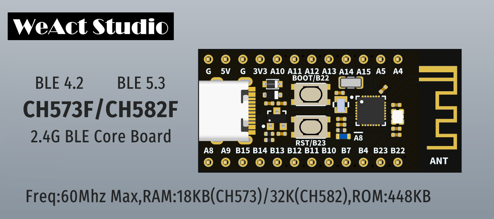
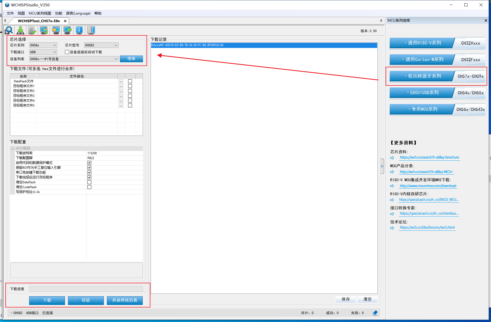

# WCH-BLE

WCH Official Website [zh-CN](www.wch.cn) / [en](www.wch-ic.com)

| Dir Name |                    Explain                    |
| :------: | :-------------------------------------------: |
|  CH573F  | 60Mhz Max,18KB RAM,448KB ROM,RISC-V3A,BLE 4.2 |
|  CH582F  | 60Mhz Max,32KB RAM,448KB ROM,RISC-V4A,BLE 5.3 |
|  CH592F  | 60Mhz Max,32KB RAM,448KB ROM,RISC-V4C,BLE 5.4 |

## BSP

**clock**：

* 32Mhz HSE 
* 32.768k LSE

**power**：

* 3.3V LDO Max 100mA

**key**：

* Reset：B23 
* Boot：B22   

## Program

1. 安装 `WCHISPTool_Setup.exe` 和 [`CH372DRV.EXE`](http://www.wch.cn/downloads/CH372DRV_EXE.html)
2. 按住BOOT键然后用USB数据线连接电脑，释放BOOT键
3. 打开 `WCHISPTool` ，选择低功耗蓝牙系列和目标芯片烧录即可。

### Note

比较方便的下载方法：买根带开关的 USB 电源线，使用串口工具连接开发板（PA9_TXD，PA8_RXD），下载接口选串口，勾选下载串口免按键下载功能。先点下载，然后快速地断电上电，过程不需要按 boot 键就能完成下载。

## VSCode

开发工具用 VSCode 的 `EIDE` 插件就行，RISC-V 工具链直接在 `EIDE` 里下载就行。 

