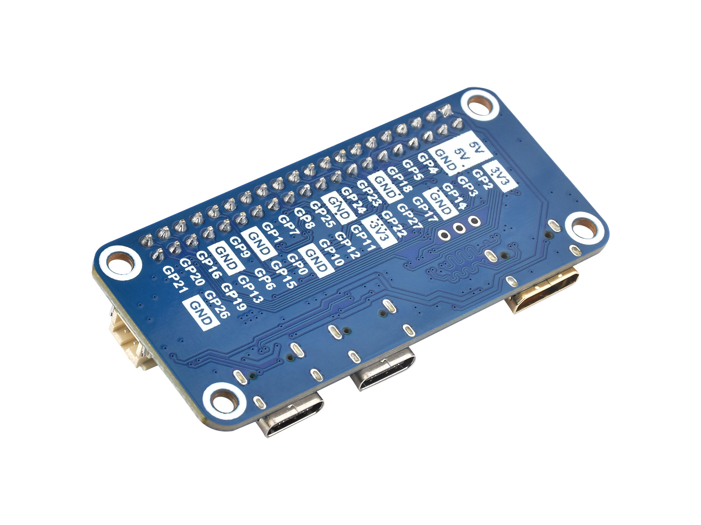
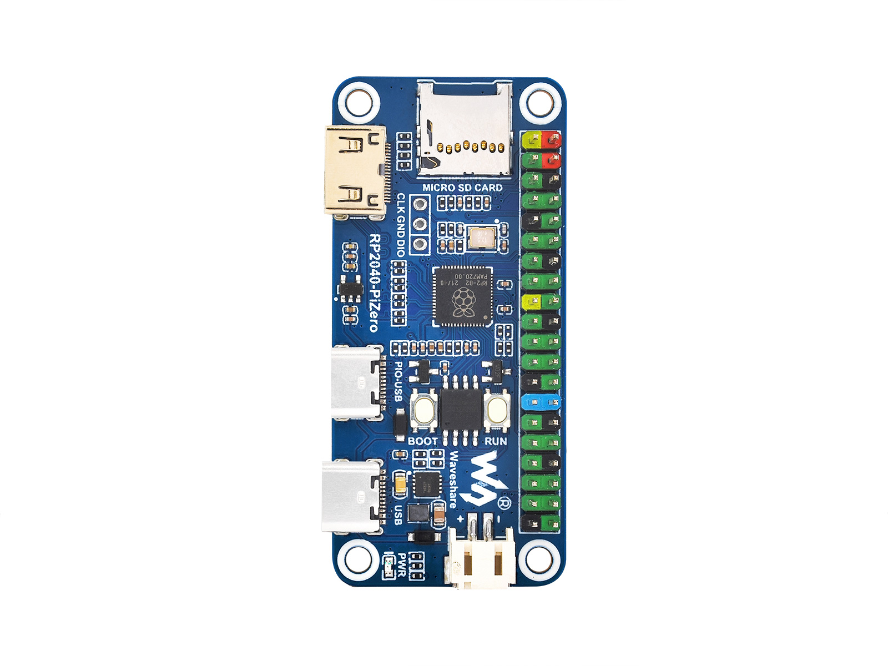
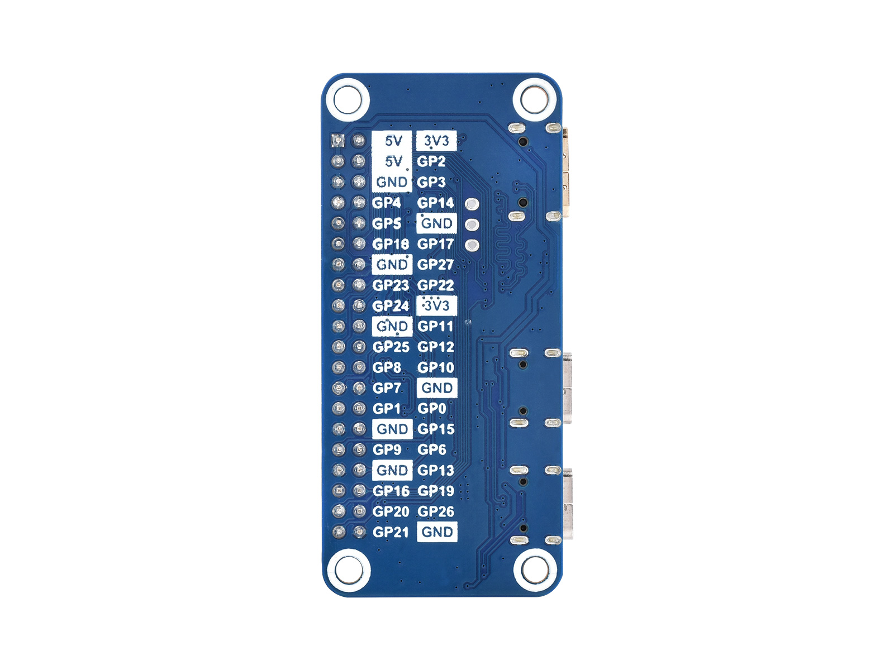
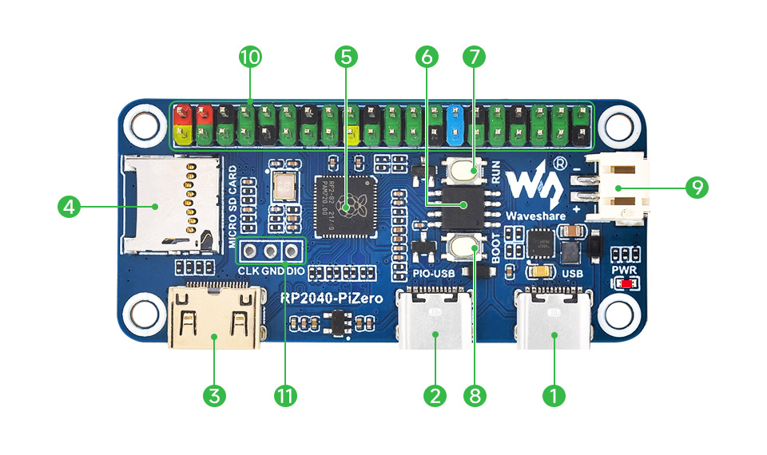
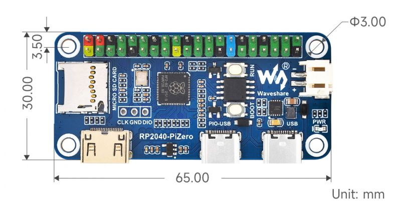

# [RP2040-PiZero](https://www.waveshare.net/shop/RP2040-PiZero.htm)

|  |  |
| ------------------------------------------ | ------------------------------------------ |
|  |  |

## 接口

1. 原生 USB Type-C 接口：可用于通讯与程序烧录
2. **PIO-USB 接口**：可通过 PIO 作为 USB 主机或者从机
3. **DVI 接口** (Mini HDMI 封装)：使用 HDMI 连接线可驱动 DVI 屏幕
4. **Micro SD 卡座**：使用 SPI 接口连接
5. RP2040：双核处理器，高达 133MHz 的运行频率
6. W25Q128JV：16MB NOR-Flash

7. RUN 按键：复位按键
8. BOOT 按键：复位时按下，进入下载模式
9. **锂电池接口**：PH2.0 连接器，可用于接入 3.7V 锂电池，支持充放电
10. 40PIN GPIO 接口：可兼容部分树莓派 HAT 扩展板
11. Debug 调试接口

## 尺寸

