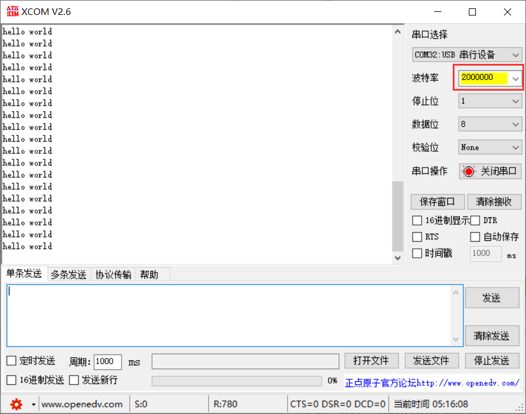

以下2选1：

---

#### 环境搭建①

平头哥 CDK

https://verimake.com/d/253-windowscdk

https://verimake.com/d/252-winvscodelinux

---

#### 环境搭建②

（注：此方法不能断点调试）

将以下3个压缩包进行解压（位置任意）：

 [博流智能 SDK](https://github.com/bouffalolab/bl_mcu_sdk) ： [bl_mcu_sdk.zip](bl_mcu_sdk.zip) 

 [平头哥 RISC-V 工具链](https://github.com/toolchain_gcc_t-head_windows) ： [toolchain_gcc_t-head_windows.zip](toolchain_gcc_t-head_windows.zip) 

 [官方烧录工具](https://dev.bouffalolab.com/download) ： [BouffaloLabDevCube-v1.8.1.zip](BouffaloLabDevCube-v1.8.1.zip)

将 `bl_mcu_sdk\tools\make` 和 `toolchain_gcc_t-head_windows\bin` 添加到系统变量：

（注：如已经安装过 RISC-V 工具链，需新工具链上移使其优先级更高）

在 `CMD` 中输入 `riscv64-unknown-elf-gcc -v`：

最后一行为 `gcc version 10.2.0 (Xuantie-900 elf newlib gcc Toolchain V2.6.1 B-20220906` 表示环境搭建成功。

#### 编译例程

进入例程 `helloworld`  ，在 `makefile` 中配置目标芯片和开发板。

在终端输入 `cd .\examples\helloworld\` 进入例程目录，输入 `make` 进行编译。

编译成功：

#### 烧录固件

Device Tree：`/BouffaloLabDevCube-v1.8.1/chips/bl616/device_tree/bl_factory_params_IoTKitA_auto.dts`

（注：报错就是没进入 BOOT 模式。按下 BOOT，按下 RESET，松开 RESET，松开 BOOT 即可）

下载完成后，点击 `Open UART` 可打开串口，也可使用其他串口助手（注意配置波特率为 2000000，1个2和6个0）：

