# GPIO

[官方例程 ](https://github.com/bouffalolab/bl_mcu_sdk)

---

##### 查看原理图

LED6（GPIO32），低电平亮，高电平灭。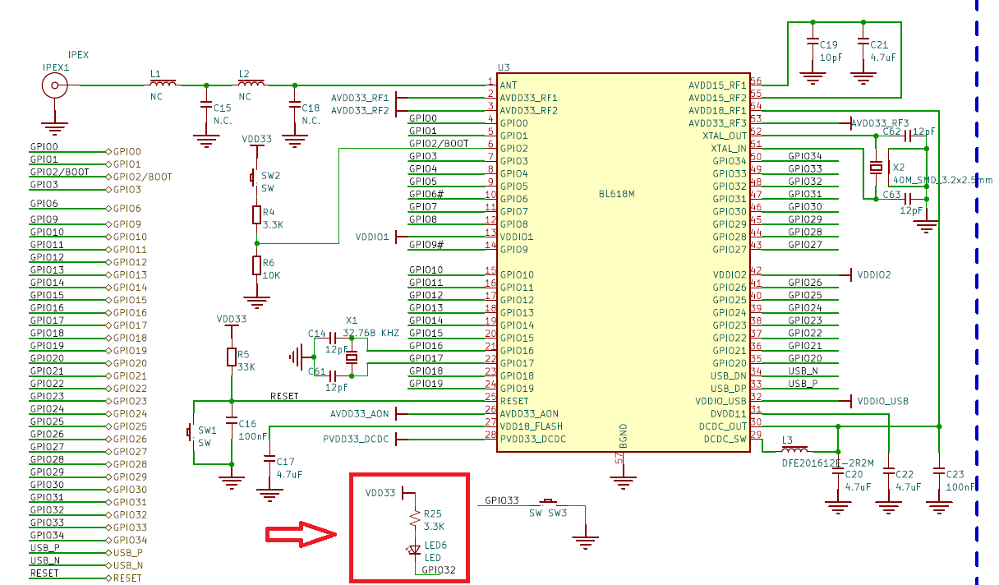

##### 编写代码

在官方例程 `examples\preipherals\gpio\gpio_output` 上进行改动：

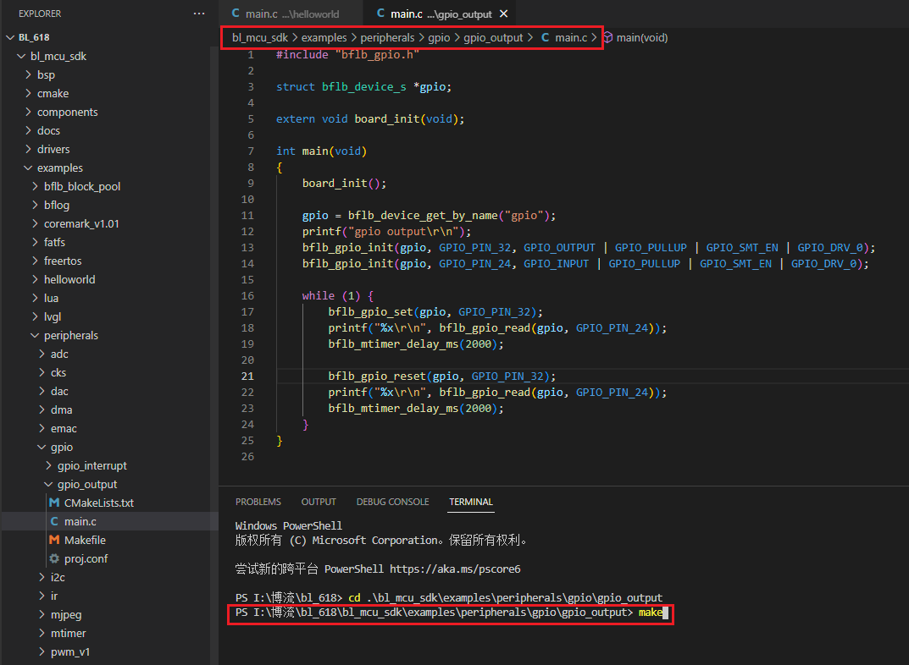

```c
#include "bflb_gpio.h"

struct bflb_device_s *gpio;

extern void board_init(void);

int main(void)
{
    board_init();

    gpio = bflb_device_get_by_name("gpio");
    printf("gpio output\r\n");
    bflb_gpio_init(gpio, GPIO_PIN_32, GPIO_OUTPUT | GPIO_PULLUP | GPIO_SMT_EN | GPIO_DRV_0);
    bflb_gpio_init(gpio, GPIO_PIN_24, GPIO_INPUT | GPIO_PULLUP | GPIO_SMT_EN | GPIO_DRV_0);

    while (1) {
        bflb_gpio_set(gpio, GPIO_PIN_32); // output = 1
        printf("%x\r\n", bflb_gpio_read(gpio, GPIO_PIN_24));
        bflb_mtimer_delay_ms(2000);

        bflb_gpio_reset(gpio, GPIO_PIN_32); // output = 0
        printf("%x\r\n", bflb_gpio_read(gpio, GPIO_PIN_24));
        bflb_mtimer_delay_ms(2000);
    }
}
```

##### 编译烧录

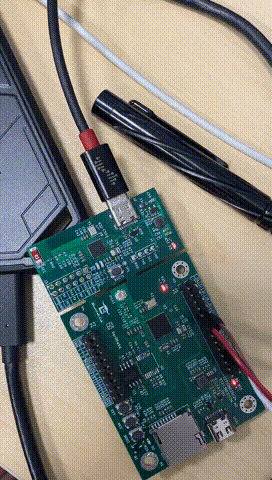

# UART

`bl_mcu_sdk\bsp\board\bl616dk\board.c`

查看 UART 引脚：UART_TX（23），UART_RX（24）

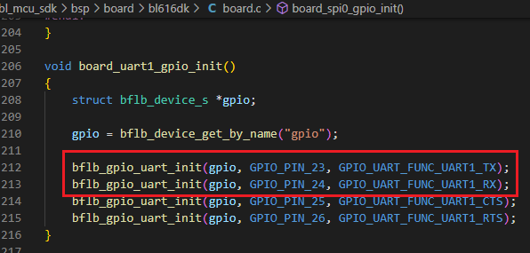

`examples\peripherals\uart\uart_poll`：轮询收发数据（收啥发啥）

硬件连线：

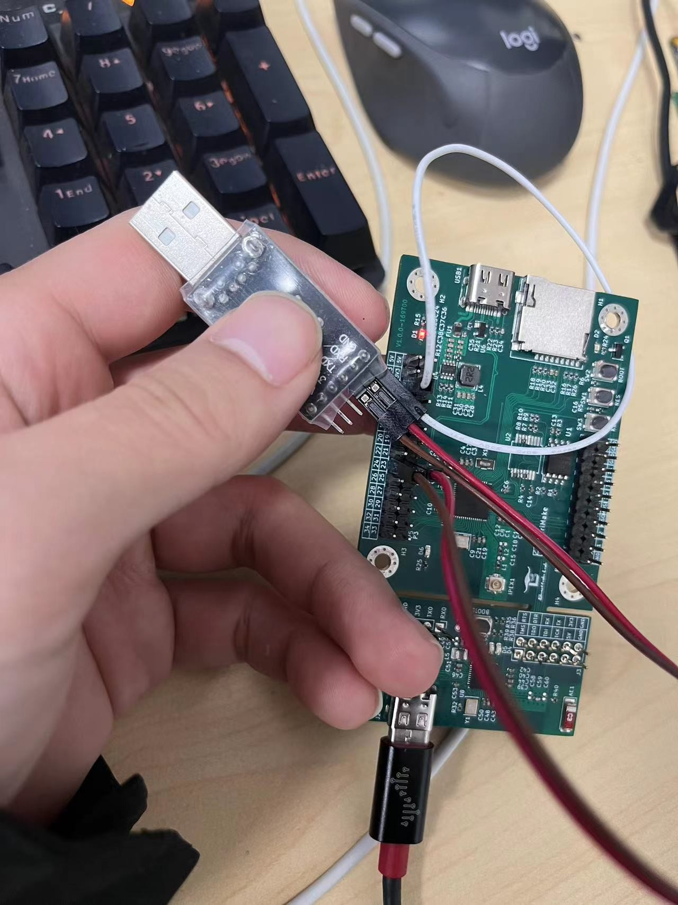

微软商店下载的串口调试助手：

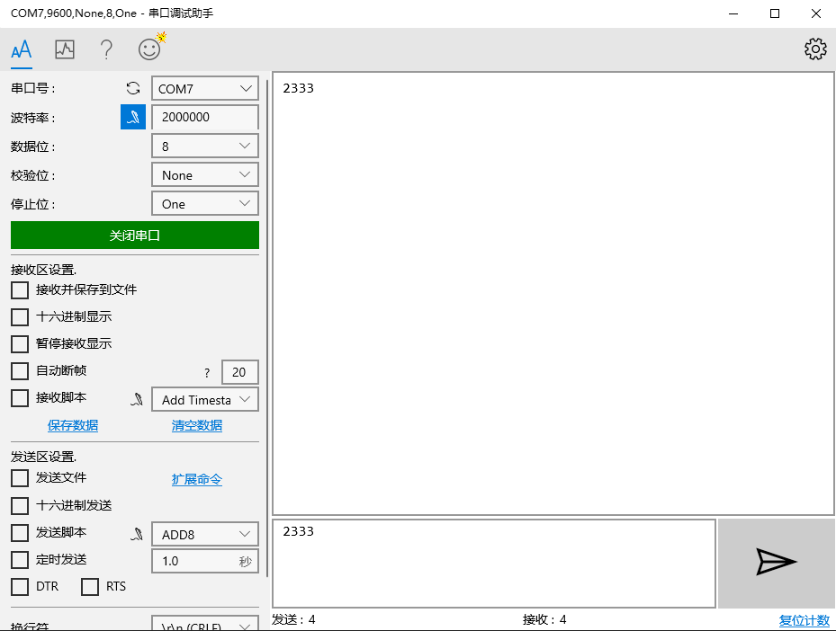

# ADC

`bl_mcu_sdk\bsp\board\bl616dk\board.c`

查看 ADC 引脚：

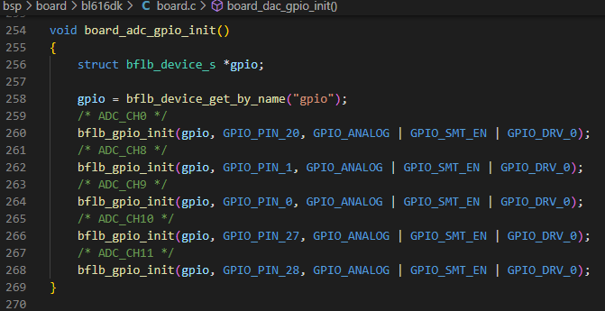

官方示例中使用的通道：ADC_CH8

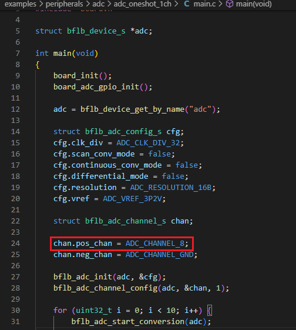

硬件连线：将 ADC_CH8 使用的 GPIO1 与板子上的 3.3V 连接

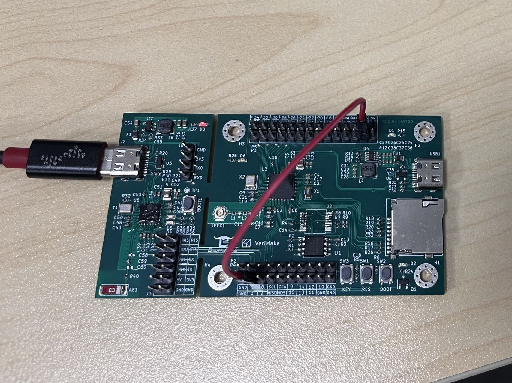

编译烧录运行：输出通道和转换后的电压值

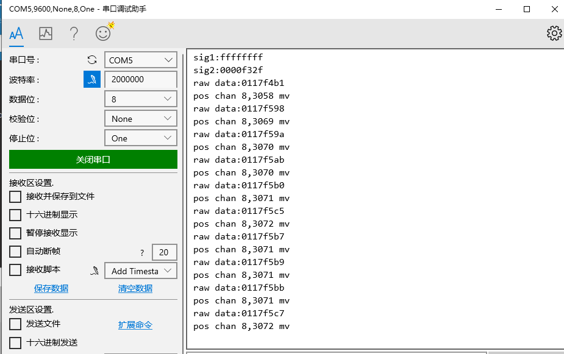

# DMA

https://verimake.com/d/268-bl618dma

在官方例程 `examples\peripherals\dma\dma_normal` 上进行改动。

原例程中分配了六块内存区域作为三组数据的起（src）止（dst）点：

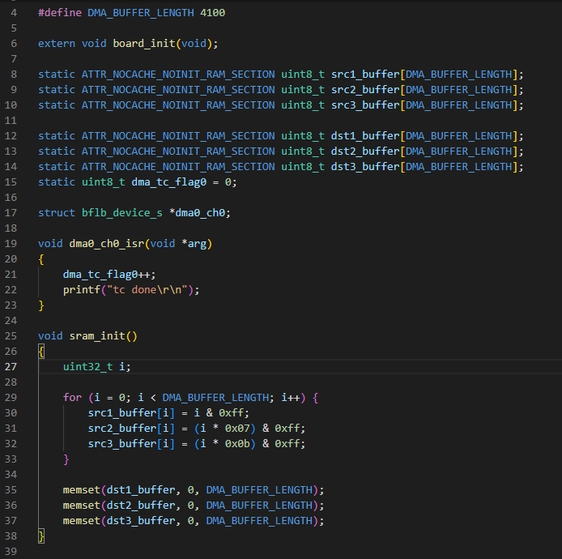