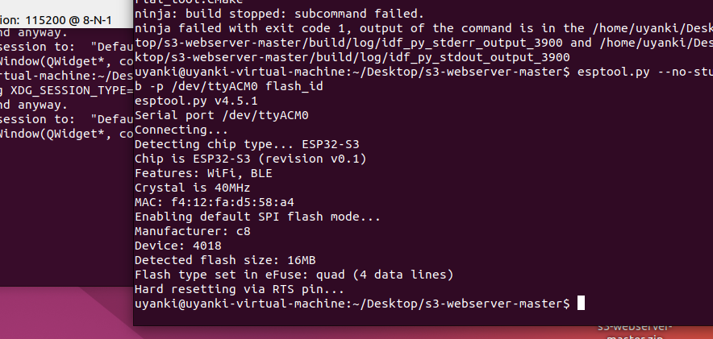
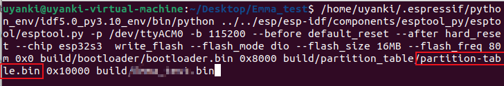

ESP-IDF on Linux

---

[espidf_on_linux](https://docs.espressif.com/projects/esp-idf/zh_CN/latest/esp32/get-started/linux-macos-setup.html) 

① 选 Ubuntu22 版本（自带 python3）

```
sudo apt-get update
sudo apt-get upgrade
```

② 安装软件包

```shell
sudo apt-get install git wget flex bison gperf python3 python3-venv python3-setuptools cmake ninja-build ccache libffi-dev libssl-dev dfu-util libusb-1.0-0
```

③ 安装软件库 ESP-IDF 至 `~/esp/espidf` 目录中


**方法**1：

```
mkdir -p ~/esp
cd ~/esp
git clone --recursive https://github.com/espressif/esp-idf.git
```

**方法**2：

或者将 `esp-idf-v5.2.1.zip` 解压到 `~/esp/espidf` 目录中。

---

最终的目录结构如下：

```
.
├── esp
│   └── esp-idf
│       ├── components
│       ├── docs
│       ├── examples
│       └── tools
```

---

文件从 windows 上通过局域网传输至 ubuntu 的方法：

* windows 端：安装 everything，开启 http 服务器，在 cmd 中使用 ipconfig 查看 ipv4（非 vmvare 的）。


* linux 端：使用火狐内打开 ipv4 的地址，选择


④ 安装工具链（编译器、调试器、Python 包等）

**方法**1：

先将服务器设置为乐鑫的，然后下载工具链

（主要是下载压缩包带 `~/.espressif/dist` 目录中，并将其解压到 `~/.espressif/tools` 中）

```shell
cd ~/esp/esp-idf
export IDF_GITHUB_ASSETS="dl.espressif.com/github_assets"
./install.sh
```

```shell
./install.sh all # 安装所有
./install.sh esp32,esp32s3 # 安装所需
```

**方法**2：

将压缩包 `espressif.zip` 解压至 ``~/.espressif` 中。

---

最终的文件树(部分)如下：

```
.   
├── .espressif
│   ├── dist
│   │   ├── esp32ulp-elf-2.35_20220830-linux-amd64.tar.gz
│   │   ├── esp-rom-elfs-20220823.tar.gz
│   │   ├── openocd-esp32-linux-amd64-0.11.0-esp32-20221026.tar.gz
│   │   ├── riscv32-esp-elf-gcc11_2_0-esp-2022r1-linux-amd64.tar.xz
│   │   ├── riscv32-esp-elf-gdb-11.2_20220823-x86_64-linux-gnu.tar.gz
│   │   ├── xtensa-esp32-elf-gcc11_2_0-esp-2022r1-linux-amd64.tar.xz
│   │   ├── xtensa-esp32s2-elf-gcc11_2_0-esp-2022r1-linux-amd64.tar.xz
│   │   ├── xtensa-esp32s3-elf-gcc11_2_0-esp-2022r1-linux-amd64.tar.xz
│   │   └── xtensa-esp-elf-gdb-11.2_20220823-x86_64-linux-gnu.tar.gz
│   ├── espidf.constraints.v5.0.txt
│   ├── idf-env.json
│   ├── python_env
│   │   └── idf5.0_py3.10_env
│   │       ├── bin
│   │       ├── include
│   │       ├── lib
│   │       │   └── python3.10
│   │       ├── lib64 -> lib
│   │       └── pyvenv.cfg
│   └── tools
│       ├── esp32ulp-elf
│       │   └── 2.35_20220830
│       │       └── esp32ulp-elf
│       ├── esp-rom-elfs
│       │   └── 20220823
│       │       ├── esp32c2_rev0_rom.elf
│       │       ├── esp32c3_rev0_rom.elf
│       │       ├── esp32c3_rev3_rom.elf
│       │       ├── esp32_rev0_rom.elf
│       │       ├── esp32_rev3_rom.elf
│       │       ├── esp32s2_rev0_rom.elf
│       │       └── esp32s3_rev0_rom.elf
│       ├── openocd-esp32
│       │   └── v0.11.0-esp32-20221026
│       │       └── openocd-esp32
│       ├── riscv32-esp-elf
│       │   └── esp-2022r1-11.2.0
│       │       └── riscv32-esp-elf
│       ├── riscv32-esp-elf-gdb
│       │   └── 11.2_20220823
│       │       └── riscv32-esp-elf-gdb
│       ├── xtensa-esp32-elf
│       │   └── esp-2022r1-11.2.0
│       │       └── xtensa-esp32-elf
│       ├── xtensa-esp32s2-elf
│       │   └── esp-2022r1-11.2.0
│       │       └── xtensa-esp32s2-elf
│       ├── xtensa-esp32s3-elf
│       │   └── esp-2022r1-11.2.0
│       │       └── xtensa-esp32s3-elf
│       └── xtensa-esp-elf-gdb
│           └── 11.2_20220823
│               └── xtensa-esp-elf-gdb
```

⑤ 设置环境变量

**方法**1：

给指令取别名：

```sh
echo "alias get_idf='. $HOME/esp/esp-idf/export.sh'" > ~/.bashrc
```

**方法**2：

显示隐藏文件：


写入文件：

```shell
alias get_idf='. $HOME/esp/esp-idf/export.sh'
```


⑥ 开始使用



选择1个esp项目，在终端输入 `get_idf` 将 esp 的虚拟环境配置到当前目录。

```shell
idf.py menuconfig # 配置
idf.py set-target esp32 # 设置目标芯片
idf.py build # 编译
idf.py flash # 烧录
```

若芯片首次烧录，烧录需包含分区表（具体命令在调用 `idf.py build` 后显示）



```
/home/uyanki/.espressif/python_env/idf5.0_py3.10_env/bin/python ../../esp/esp-idf/components/esptool_py/esptool/esptool.py -p /dev/ttyACM0 -b 921600 --before default_reset --after hard_reset --chip esp32s3  write_flash --flash_mode dio --flash_size 16MB --flash_freq 80m 0x0 build/bootloader/bootloader.bin 0x8000 build/partition_table/partition-table.bin 0x10000 build/s3-webserver.bin
```

烧录固件至串口号为 `/dev/ttyACM0 ` 的板子中 （需先进入 ISP 模式）：

```shell
get_idf
sudo chmod 777 /dev/ttyACM0
idf.py -p /dev/ttyACM0 -b 115200 flash
idf.py -p /dev/ttyACM0 flash

idf.py -p /dev/ttyACM0 -b 921600 flash

sudo chmod 777 /dev/ttyS0
idf.py -p /dev/ttyS0 -b 115200 flash

idf.py -b 115200 flash

esptool.py --no-stub -p /dev/ttyACM0 flash_id
```

#### 串口存在却打不开？

`idf.py flash` 提示找不到串口，是因为权限不够。

① 临时方法：更改目标串口权限。

```
sudo chmod 777 /dev/ttyACM0
sudo chmod 777 /dev/ttyUSB0
sudo chmod 777 /dev/ttyS0
```

② 永久方法：

```bash
# 查看串口所在用户组
$ ls -l /dev/ttyUSB0
$ ls -l /dev/ttyACMB0
$ ls -l /dev/ttyS0
crw-rw---- 1 root dialout 4, 64 10月 12 14:08 /dev/ttyUSB0

# 查看 dialout 用户组成员
$ grep 'dialout' /etc/group
dialout:x:20:

# 将当前用户加入组( uyanki 是目标用户名 )
$ sudo usermod -aG dialout uyanki

$ grep 'dialout' /etc/group
dialout:x:20:uyanki
```

错误

```
A fatal error occurred: Packet content transfer stopped (received 25 bytes)

下载前出现：可能是USB线头不稳，按紧试试
下载后出现：无所谓，程序运行了就不用管


idf.py erase-flash
```

---

查找串口号

**方法**1：

```
ls /dev/tty*
```

将板子1插1拔，多出的串口号就是目标串口号了。


**方法**2：

安装串口工具查看可用端口

```shell
sudo apt-get install cutecom # 安装
cutecom # 运行
```

