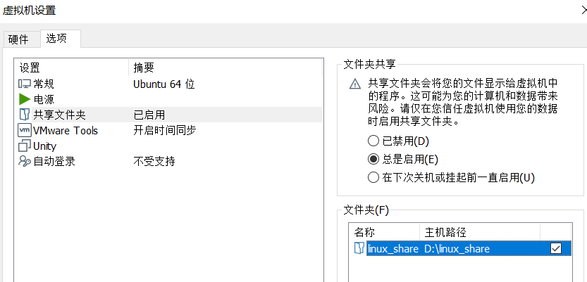
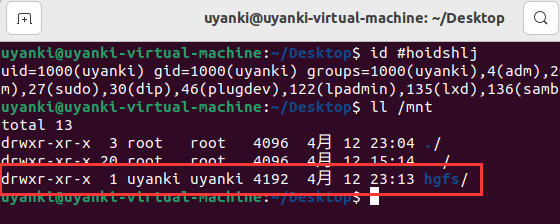
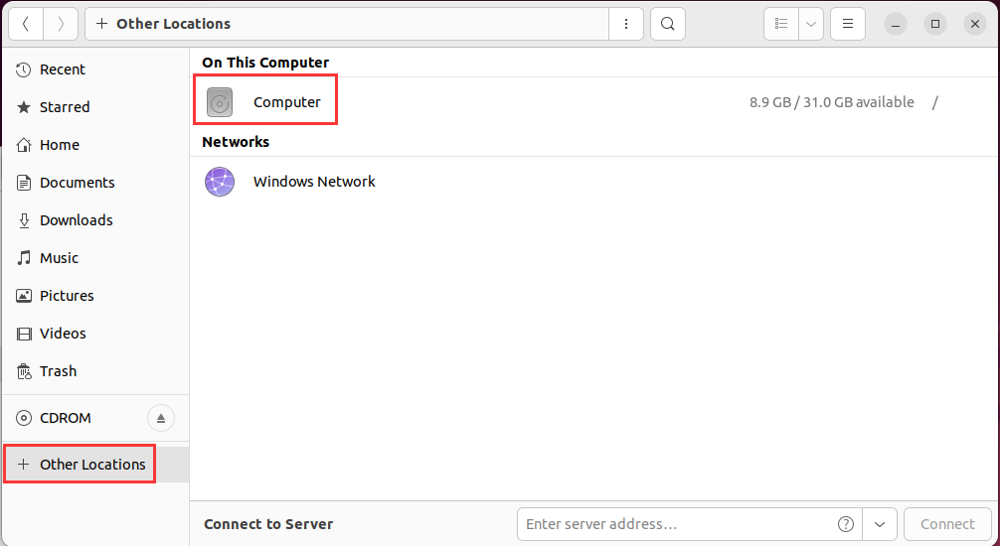
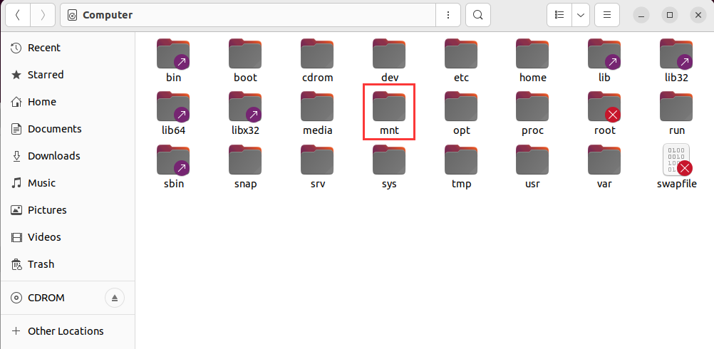
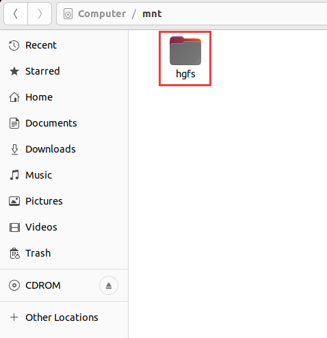
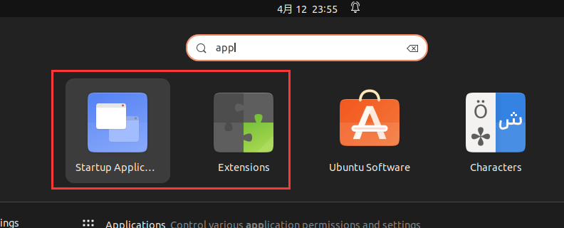
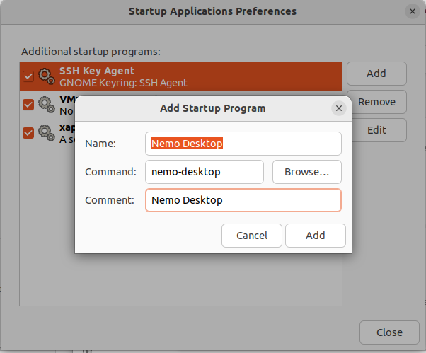

```
sudo apt-get update
sudo apt-get upgrade

# 备份源列表
sudo cp /etc/apt/sources.list /etc/apt/sources.list_backup 

# 编译源列表(以下三选一加到最前即可)
sudo gedit /etc/apt/sources.list

# 阿里源
deb http://mirrors.aliyun.com/ubuntu/ bionic main restricted universe multiverse
deb http://mirrors.aliyun.com/ubuntu/ bionic-security main restricted universe multiverse
deb http://mirrors.aliyun.com/ubuntu/ bionic-updates main restricted universe multiverse
deb http://mirrors.aliyun.com/ubuntu/ bionic-proposed main restricted universe multiverse
deb http://mirrors.aliyun.com/ubuntu/ bionic-backports main restricted universe multiverse
deb-src http://mirrors.aliyun.com/ubuntu/ bionic main restricted universe multiverse
deb-src http://mirrors.aliyun.com/ubuntu/ bionic-security main restricted universe multiverse
deb-src http://mirrors.aliyun.com/ubuntu/ bionic-updates main restricted universe multiverse
deb-src http://mirrors.aliyun.com/ubuntu/ bionic-proposed main restricted universe multiverse
deb-src http://mirrors.aliyun.com/ubuntu/ bionic-backports main restricted universe multiverse

# 中科大源
deb https://mirrors.ustc.edu.cn/ubuntu/ bionic main restricted universe multiverse
deb-src https://mirrors.ustc.edu.cn/ubuntu/ bionic main restricted universe multiverse
deb https://mirrors.ustc.edu.cn/ubuntu/ bionic-updates main restricted universe multiverse
deb-src https://mirrors.ustc.edu.cn/ubuntu/ bionic-updates main restricted universe multiverse
deb https://mirrors.ustc.edu.cn/ubuntu/ bionic-backports main restricted universe multiverse
deb-src https://mirrors.ustc.edu.cn/ubuntu/ bionic-backports main restricted universe multiverse
deb https://mirrors.ustc.edu.cn/ubuntu/ bionic-security main restricted universe multiverse
deb-src https://mirrors.ustc.edu.cn/ubuntu/ bionic-security main restricted universe multiverse
deb https://mirrors.ustc.edu.cn/ubuntu/ bionic-proposed main restricted universe multiverse
deb-src https://mirrors.ustc.edu.cn/ubuntu/ bionic-proposed main restricted universe multiverse

# 清华源
deb https://mirrors.tuna.tsinghua.edu.cn/ubuntu/ bionic main restricted universe multiverse
deb-src https://mirrors.tuna.tsinghua.edu.cn/ubuntu/ bionic main restricted universe multiverse
deb https://mirrors.tuna.tsinghua.edu.cn/ubuntu/ bionic-updates main restricted universe multiverse
deb-src https://mirrors.tuna.tsinghua.edu.cn/ubuntu/ bionic-updates main restricted universe multiverse
deb https://mirrors.tuna.tsinghua.edu.cn/ubuntu/ bionic-backports main restricted universe multiverse
deb-src https://mirrors.tuna.tsinghua.edu.cn/ubuntu/ bionic-backports main restricted universe multiverse
deb https://mirrors.tuna.tsinghua.edu.cn/ubuntu/ bionic-security main restricted universe multiverse
deb-src https://mirrors.tuna.tsinghua.edu.cn/ubuntu/ bionic-security main restricted universe multiverse
deb https://mirrors.tuna.tsinghua.edu.cn/ubuntu/ bionic-proposed main restricted universe multiverse
deb-src https://mirrors.tuna.tsinghua.edu.cn/ubuntu/ bionic-proposed main restricted universe multiverse


```


```
拉取镜像

docker pull ghcr.io/kendryte/k230_sdk:latest
docker pull ghcr.io/kendryte/k230_sdk
docker images | grep k230_sdk

make prepare_sourcecode

net start com.docker.service

https://github.com/kendryte/k230_sdk/pkgs/container/k230_sdk/166348354?tag=latest


{
  "features": {
    "buildkit": true
  },
  "experimental": true,
  "registry-mirrors": [
    "https://docker.mirrors.ustc.edu.cn",
    "http://hub-mirror.c.163.com",
    "https://registry.docker-cn.com"
  ]
}

net user administrator /active:yes
```


```
# 禁用“连接您的在线帐户”对话框
sudo apt remove --purge gnome-online-accounts
```


```
sudo gedit /etc/hosts

# GitHub Start 
140.82.113.3      github.com
140.82.114.20     gist.github.com
151.101.184.133    assets-cdn.github.com
151.101.184.133    raw.githubusercontent.com
151.101.184.133    gist.githubusercontent.com
151.101.184.133    cloud.githubusercontent.com
151.101.184.133    camo.githubusercontent.com
151.101.184.133    avatars0.githubusercontent.com
199.232.68.133     avatars0.githubusercontent.com
199.232.28.133     avatars1.githubusercontent.com
151.101.184.133    avatars1.githubusercontent.com
151.101.184.133    avatars2.githubusercontent.com
199.232.28.133     avatars2.githubusercontent.com
151.101.184.133    avatars3.githubusercontent.com
199.232.68.133     avatars3.githubusercontent.com
151.101.184.133    avatars4.githubusercontent.com
199.232.68.133     avatars4.githubusercontent.com
151.101.184.133    avatars5.githubusercontent.com
199.232.68.133     avatars5.githubusercontent.com
151.101.184.133    avatars6.githubusercontent.com
199.232.68.133     avatars6.githubusercontent.com
151.101.184.133    avatars7.githubusercontent.com
199.232.68.133     avatars7.githubusercontent.com
151.101.184.133    avatars8.githubusercontent.com
199.232.68.133     avatars8.githubusercontent.com
# GitHub End
```


From：

https://blog.csdn.net/weixin_45813658/article/details/124773315

https://blog.csdn.net/slampai/article/details/128185055

##### 重装 vmtool

卸载先前安装的 vmtool 和 open-vm-tools

```shell
sudo vmware-uninstall-tools.pl
sudo apt-get remove open-vm-tools
sudo apt-get remove --auto-remove open-vm-tools
sudo apt-get purge open-vm-tools
sudo apt-get purge --auto-remove open-vm-tools
```

重新安装 open-vm-tools 和 open-vm-tools-desktop

```shell
sudo apt install open-vm-tools*
```

##### 挂载文件夹

关闭虚拟机，设置共享文件夹



如已挂载 hgfs，需先取消挂载

```shell
sudo umount /mnt/hgfs
```

查询 home目录下查询 uid，gid 和 umask

```shell
id
```

重新挂载 hgfs（根据上一步的查询结果，更新下一个命令中 uid，gid 和 umask 值）

```
sudo /usr/bin/vmhgfs-fuse .host:/ /mnt/hgfs -o allow_other -o uid=1000 -o gid=1000 -o umask=022
```

若提示 fuse：mountpoint is not empt，更换成以下指令：

```
sudo /usr/bin/vmhgfs-fuse .host:/ /mnt/hgfs -o nonempty -o allow_other -o uid=1000 -o gid=1000 -o umask=022
```

查询 /mnt 路径下文件权限，通常情况下，hgfs 文件夹的所有者变成了当前的 Linux 用户名。



##### 开机自挂载

因重启后权限会变回去，因此需设置开机自动挂载。

打开配置文件

```
sudo gedit /etc/fstab 
```

写入以下内容

```
.host:/ /mnt/hgfs   fuse.vmhgfs-fuse  allow_other,uid=1000,gid=1000,umask=022  0 0
```

##### 共享文件夹







##### 文件拖拽

```shell
sudo apt install gnome-shell-extension-prefs
sudo apt install nemo
```

左下角搜索：



将 extension 中的 Desktop icons NG 关闭
在 startup application preference 添加以下内容



```
Nemo Desktop
nemo-dsektop
```

