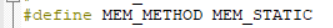

# Air001-CoreMark
Air001的CoreMark跑分工程

基于Keil MDK移植的Air001的跑分工程，默认的主频为48MHz，使用AC6编译器的-Ofast优化等级，可以自行修改主频以及优化等级。日志默认采用串口0（PA2/PA3）输出，波特率为115200。

要使用 MEM_STATIC 方式，使用 MEM_MALLOC 会触发 HardFault_Handler：



默认工程的跑分结果参考：

```text
2K performance run parameters for coremark.
CoreMark Size    : 666
Total ticks      : 35547
Total time (secs): 35.547000
Iterations/Sec   : 56.263538
Iterations       : 2000
Compiler version : ArmClang 13.0.0 (ssh://ds-gerrit/armcompiler/llvm-project 1f5770d6f72ee4eba2159092bbf4cbb819be323a)
Compiler flags   : -Ofast
Memory location  : STACK
seedcrc          : 0xe9f5
[0]crclist       : 0xe714
[0]crcmatrix     : 0x1fd7
[0]crcstate      : 0x8e3a
[0]crcfinal      : 0x4983
Correct operation validated. See README.md for run and reporting rules.
CoreMark 1.0 : 56.263538 / ArmClang 13.0.0 (ssh://ds-gerrit/armcompiler/llvm-project 1f5770d6f72ee4eba2159092bbf4cbb819be323a) -Ofast / STACK
```
