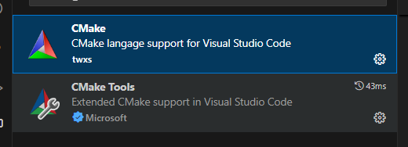

# Toolchain

cmake-3.26.4-windows-x86_64.msi

gcc-arm-none-eabi-10.3-2021.10-win32.exe

[pico-sdk](https://github.com/raspberrypi/pico-sdk)

## VSCode

### Extensions



### `settings.json`

#### pico-sdk 1.x.x

```json
  "cmake.generator": "MinGW Makefiles",
  "cmake.configureEnvironment": {
    "PICO_SDK_PATH": "C:\\emkit\\libc\\raspberrypi\\pico-sdk",
  },
```

#### pico-sdk 2.x.x


```json
  "cmake.generator": "MinGW Makefiles",
  "cmake.configureEnvironment": {
    "PICO_SDK_PATH": "C:\\emkit\\libc\\raspberrypi\\pico-sdk",
    "picotool_DIR": "C:\\emkit\\libc\\raspberrypi\\pico-sdk\\picotool",
  },
```

### `c_cpp_properties.json`

```json
{
    // from https://github.com/raspberrypi/pico-setup-windows/releases
    // -> packages\pico-examples\ide\vscode
    "configurations": [
        {
            "name": "Pico",
            "includePath": [
                "${workspaceFolder}/**",
                "${env:PICO_SDK_PATH}/**"
            ],
            "defines": [],
            "compilerPath": "${env:PICO_INSTALL_PATH}/gcc-arm-none-eabi/bin/arm-none-eabi-gcc.exe",
            "cStandard": "c11",
            "cppStandard": "c++11",
            "intelliSenseMode": "linux-gcc-arm",
            "configurationProvider": "ms-vscode.cmake-tools"
        }
    ],
    "version": 4
}
```

