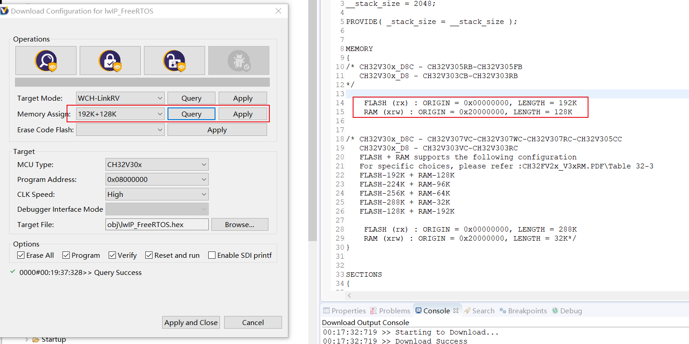
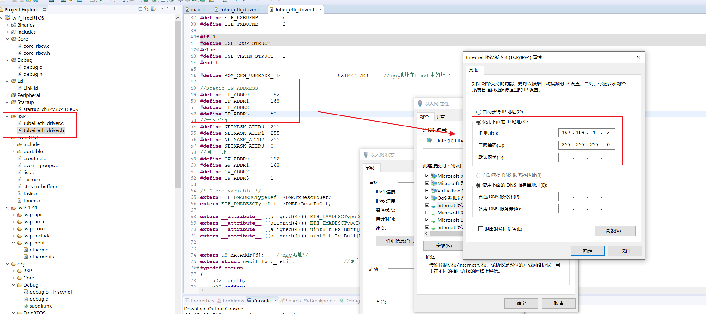
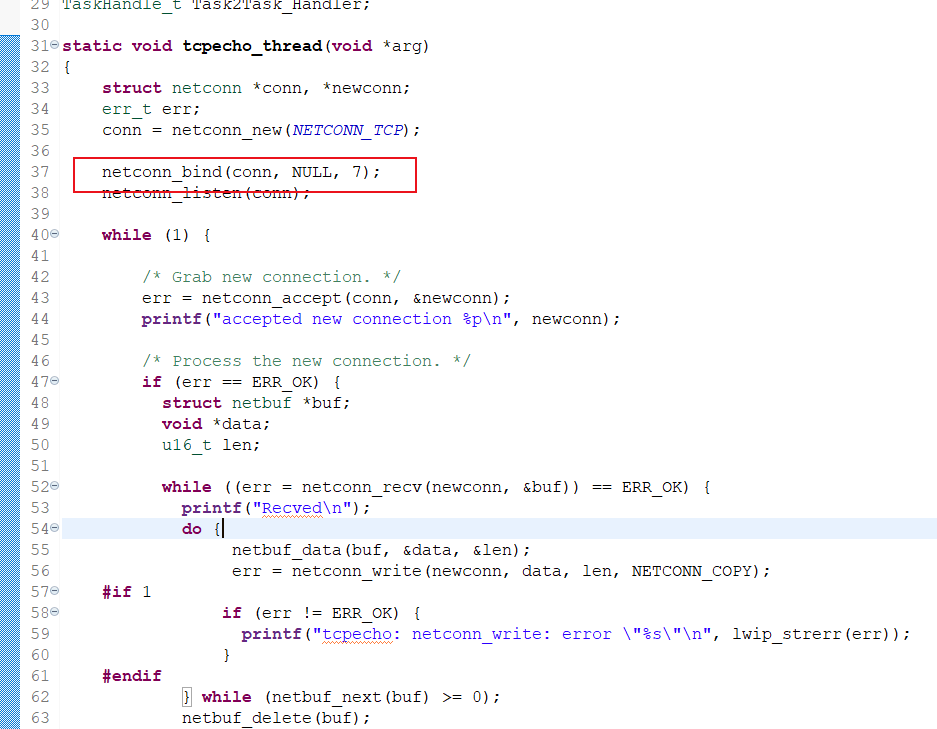
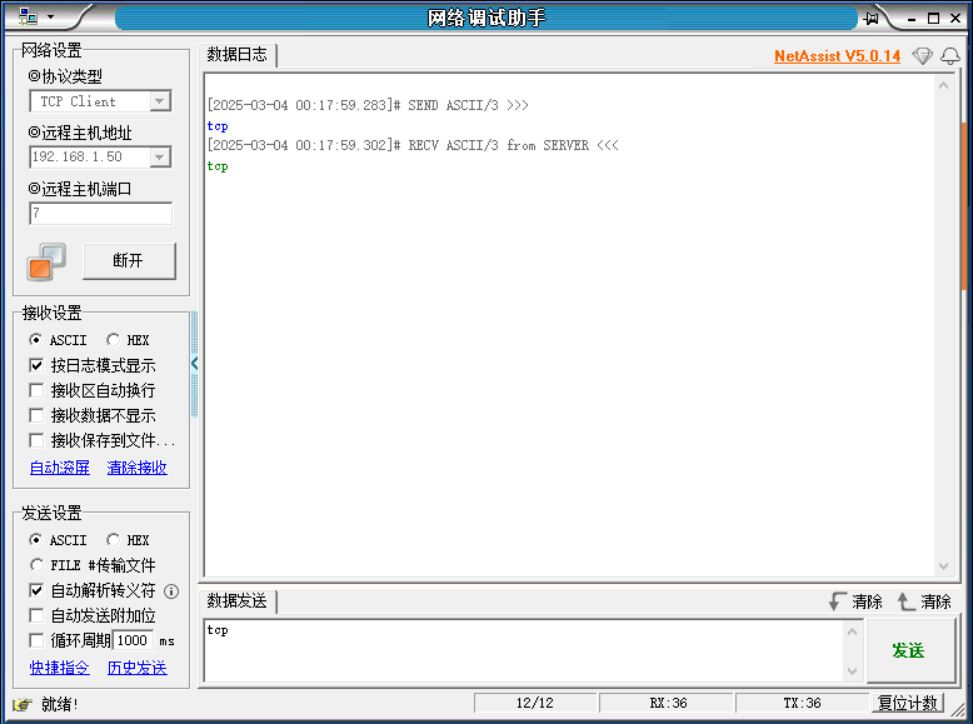

# CH32V307_lwIP-1.41_FreeRTOS

将lwIP1.41与FreeRTOS移植到ch32V307上（NETCONN API）  

使用芯片内部的10MPHY层实现TCPIP协议栈    

##### Memory 配置

烧录时，需选择相应的 Memory 配置，并点击 Apply。

##### 配置 IP 地址

##### TCP 测试

例程是做TCP服务器，开放的端口号为 7。

使用调试工具连接即可。

